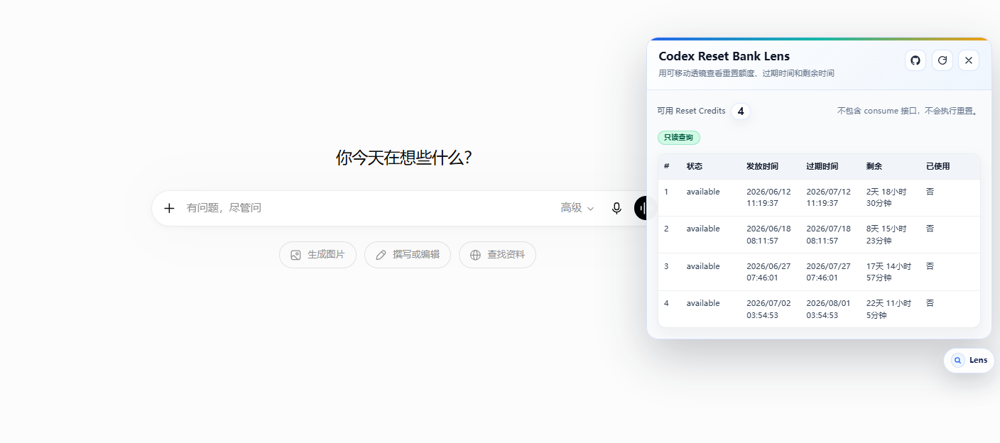

[](https://greasyfork.org/zh-CN/scripts/PLACEHOLDER_SCRIPT_ID)
[](https://github.com/Super-YYQ/codex-reset-bank-lens)

# Codex Reset Bank Lens

一个运行在 `https://chatgpt.com/*` 上的 Tampermonkey 用户脚本，用一个可移动的“透镜”面板只读查看当前登录账号的 ChatGPT Codex reset credits 信息，包括重置额度、充值额度关键词、发放时间、过期时间、剩余时间和使用状态。

## 功能列表

- 查看可用 reset credits / 重置额度数量，便于通过“Codex 充值额度”“重置额度”等关键词检索。
- 查看每个 reset credit 的发放时间、过期时间、剩余时间。
- 查看 reset credit 是否已使用，以及使用时间。
- 标记最近一次即将过期的 reset credit。
- 如果接口返回中存在下次额度重置相关字段，会尝试展示。
- 自动根据浏览器语言显示中文或英文界面。
- 对接口结构变化做递归查找，避免只依赖固定字段路径。
- 处理未登录、401、无明细、接口非 JSON 等状态。
- 右下角悬浮入口支持拖拽移动，弹出的面板会跟随入口并自动限制在视口内。
- 使用浅色玻璃面板和蓝绿琥珀状态线，避免和常见深色监控弹窗撞脸。

## Screenshots



## 安装方式

### Greasy Fork 安装

打开 Greasy Fork 页面并安装：

https://greasyfork.org/zh-CN/scripts/586281-codex-reset-bank-lens

### GitHub raw 安装

打开以下 raw 链接，Tampermonkey 会提示安装：

https://raw.githubusercontent.com/Super-YYQ/codex-reset-bank-lens/main/codex-reset-bank-lens.user.js

## 使用方式

1. 安装 Tampermonkey。
2. 安装本脚本。
3. 打开 `https://chatgpt.com/`。
4. 确认已经登录 ChatGPT 账号。
5. 点击页面右下角的 `Lens` 悬浮入口。
6. 需要调整位置时，直接拖动这个入口。
7. 在浅色透镜面板中查看 reset credits 明细。

## 安全说明

- 本脚本只在 `https://chatgpt.com/*` 运行。
- 本脚本请求 `/api/auth/session` 获取当前网页 session 中的 `accessToken`。
- 本脚本请求 `/backend-api/wham/rate-limit-reset-credits` 获取 reset credits 数据。
- `accessToken` 只用于请求 `chatgpt.com` 自己的相对路径接口。
- 本脚本不会把 `accessToken` 发送到任何第三方服务器。
- 本脚本不会调用任何 consume/reset 执行类接口，不会执行重置。
- 本脚本没有远程 `@require` 依赖。
- 本脚本没有统计、埋点或日志上传代码。
- 本脚本会在浏览器控制台打印 reset credits 接口的原始返回，方便接口变化时排查；不会打印 `accessToken`。

## 非官方声明

This is an unofficial userscript.

It depends on internal ChatGPT endpoints. It may stop working if OpenAI changes the API.

本项目不是 OpenAI 官方项目，也不代表 OpenAI 或 ChatGPT。脚本依赖 ChatGPT 内部接口，接口结构、权限和返回内容都可能变化。

## 开发说明

本项目不需要构建工具：

- 纯 JavaScript。
- 不使用 TypeScript。
- 不使用 npm。
- 一个 `.user.js` 文件即可直接安装。

开发时可以直接编辑：

```text
codex-reset-bank-lens.user.js
```

并确认它们已经替换成你自己的发布信息。

## License

MIT License. See [LICENSE](LICENSE).

